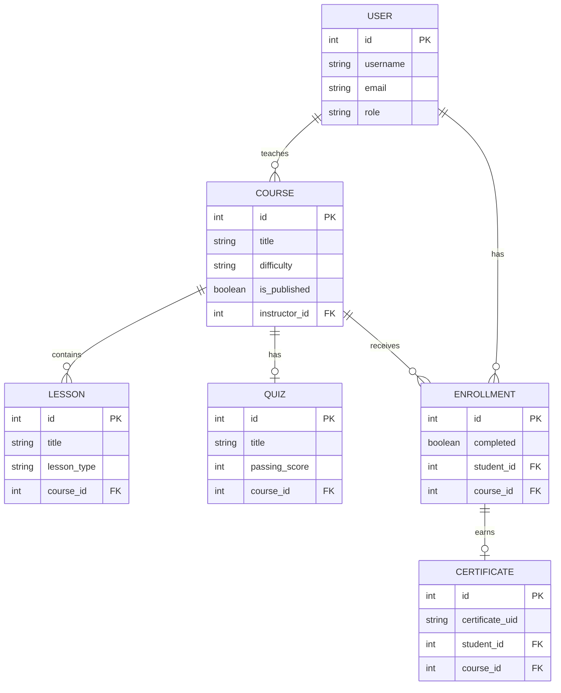
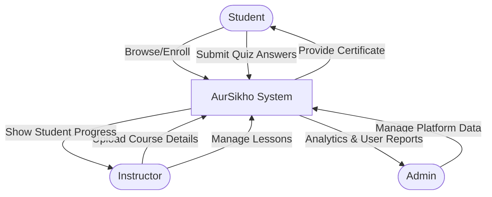

# A Project Report On
# AurSikho – Online Course Enrollment System

**Submitted by:**
- Ashish Baviskar (SRN: 31251941)
- Himanshi Ladda (SRN: 31251597)

**Div:** B  
**MCA – I     SEM – II**

**Under the guidance of:**
Prof. Khushbu Kushwaha

**For the Academic Year 2025-26**  
**Vishwakarma University**  
Kondhwa, Pune.

---

## CERTIFICATE
This is to certify that our team has successfully completed the project work entitled **"AurSikho – Online Course Enrollment System"** in partial fulfilment of MCA – I SEM – II for the year 2025-2026. The team has worked under my guidance and direction.

**Date:** 23 April 2026  
**Place:** Pune  
**Guide Signature:** ___________________ (Prof. Khushbu Kushwaha)

---

## DECLARATION
We certify that the work contained in this report is original and has been done by us under the guidance of our guide. The work has not been submitted to any other Institute for any degree or diploma. We have followed the guidelines provided by the Institute in preparing the report and conformed to the norms and guidelines given in the Ethical Code of Conduct of the Institute.

**Name and Signature of Project Team Members:**
1. Ashish Baviskar (SRN: 31251941) ______________
2. Himanshi Ladda (SRN: 31251597) ______________

---

## INDEX
1. **CHAPTER 1: INTRODUCTION**
   - 1.1 Abstract
   - 1.2 Existing System and Need for System
   - 1.3 Scope of System
   - 1.4 Operating Environment
   - 1.5 Brief Description of Technology Used
2. **CHAPTER 2: PROPOSED SYSTEM**
   - 2.1 Feasibility Study
   - 2.2 Objectives of the Proposed System
3. **CHAPTER 3: ANALYSIS AND DESIGN**
   - 3.1 Entity Relationship Diagram (ERD)
   - 3.2 Use Case Diagram
   - 3.3 Data Flow Diagram (DFD)
4. **CHAPTER 4: IMPLEMENTATION**
   - 4.1 Modules
5. **CHAPTER 5: CONCLUSION**

---

## CHAPTER 1: INTRODUCTION

### 1.1 Abstract
"AurSikho" is an online course enrollment system designed to facilitate digital learning. It provides a platform where instructors can create and manage courses, including hybrid video and text lessons, as well as multiple-choice quizzes. Students can browse, enroll in, and complete these courses completely free of charge. Upon successful completion of all lessons and the final quiz, students are automatically issued a verifiable digital certificate. The platform aims to bridge the gap between expert knowledge and eager learners through an accessible, responsive, and easy-to-use web interface.

### 1.2 Existing System and Need for System
Existing traditional education systems and early-generation LMS platforms often suffer from being overly complex, expensive, and lacking in automated credentialing.
- High costs for premium courses limit accessibility.
- Manual tracking of student progress is tedious for instructors.
- Lack of automated, verifiable certificate generation leads to administrative overhead.
There is a need for a streamlined, free-to-use platform that automates progress tracking and certificate issuance while providing a rich, hybrid learning experience.

### 1.3 Scope of System
- **Role-Based Access:** Separate dashboards for Students, Instructors, and Administrators.
- **Course Management:** Instructors can create published/draft courses with custom categories and difficulty levels.
- **Hybrid Content:** Lessons can consist of YouTube video embeds, rich text, or both.
- **Automated Assessments:** Instructors can create quizzes with passing thresholds.
- **Progress Tracking:** Students have real-time progress bars and lesson tracking.
- **Verifiable Certificates:** Auto-generated PNG certificates with unique verification UIDs.

### 1.4 Operating Environment
- **Server-side Requirement:** Standard Cloud Server / Local Machine, Python 3.9+, SQLite3 Database.
- **Client-side Requirement:** Any modern web browser (Chrome, Safari, Firefox), Internet connection.

### 1.5 Brief Description of Technology Used
- **Python Flask:** A lightweight WSGI web application framework used to build the backend logic, handle routing, and manage application state.
- **Flask-SQLAlchemy:** An extension for Flask that adds support for SQLAlchemy, providing an Object Relational Mapper (ORM) for SQLite3.
- **Bootstrap 5:** A powerful front-end framework used to create responsive, mobile-first web pages with custom CSS glassmorphic aesthetics.
- **Pillow (PIL):** Python Imaging Library used for programmatically drawing and generating customized completion certificates.
- **Jinja2:** A fast, expressive, extensible templating engine utilized to render dynamic HTML pages.

---

## CHAPTER 2: PROPOSED SYSTEM

### 2.1 Feasibility Study
- **Technical Feasibility:** The project utilizes established, open-source technologies (Python, Flask, SQLite, Bootstrap) that are well-documented and robust, ensuring smooth development and deployment.
- **Economic Feasibility:** Built entirely on open-source software, the system requires zero licensing fees. It can be hosted on free or low-cost cloud platforms, making it highly cost-effective.
- **Operational Feasibility:** The intuitive, role-segregated user interface ensures that students can easily learn and instructors can easily teach without requiring advanced technical skills.

### 2.2 Objectives of the Proposed System
- Provide a completely free digital learning environment.
- Empower instructors with simple tools to create hybrid (video + text) lessons.
- Automate student progress tracking per course.
- Evaluate students via dynamic MCQ quizzes.
- Programmatically issue visually appealing certificates of completion.
- Allow public verification of issued certificates to prevent fraud.

---

## CHAPTER 3: ANALYSIS AND DESIGN

### 3.1 Entity Relationship Diagram (ERD)



### 3.2 Use Case Diagram

```mermaid
usecaseDiagram
    actor Student
    actor Instructor
    actor Admin

    package "AurSikho System" {
        usecase "Browse Courses" as UC1
        usecase "Enroll in Course" as UC2
        usecase "Complete Lessons" as UC3
        usecase "Take Quiz" as UC4
        usecase "Download Certificate" as UC5
        
        usecase "Create Course" as UC6
        usecase "Manage Lessons/Quiz" as UC7
        usecase "View Enrolled Students" as UC8
        
        usecase "Manage Users" as UC9
        usecase "View Platform Stats" as UC10
    }

    Student --> UC1
    Student --> UC2
    Student --> UC3
    Student --> UC4
    Student --> UC5

    Instructor --> UC6
    Instructor --> UC7
    Instructor --> UC8

    Admin --> UC9
    Admin --> UC10
```

### 3.3 Data Flow Diagram (DFD) - Level 0



---

## CHAPTER 4: IMPLEMENTATION

### 4.1 Modules
1. **Authentication Module:** Manages user registration, login, session handling, and role verification (Student, Instructor, Admin). Passwords are securely hashed using PBKDF2.
2. **Course Management Module:** Allows instructors to define courses, set difficulty and categories, and manage state (Draft vs. Published).
3. **Lesson & Content Module:** Supports creation of Video, Text, and Hybrid lessons. Integrates automatic YouTube embed conversion.
4. **Assessment Module:** Handles creation of multiple-choice questions, auto-grading student submissions, and calculating pass/fail against instructor thresholds.
5. **Certificate Module:** Integrates with the Pillow library to dynamically draw text onto a master certificate template, generate a unique verification UUID, and serve the image to the student.

---

## CHAPTER 5: CONCLUSION
The "AurSikho" Online Course Enrollment System provides a robust, scalable, and user-friendly platform for free digital education. By automating progress tracking, assessments, and certificate generation, it eliminates administrative overhead for instructors and creates a seamless learning journey for students. The use of modern web technologies like Flask and Bootstrap ensures a performant and visually engaging experience across all devices.

---
